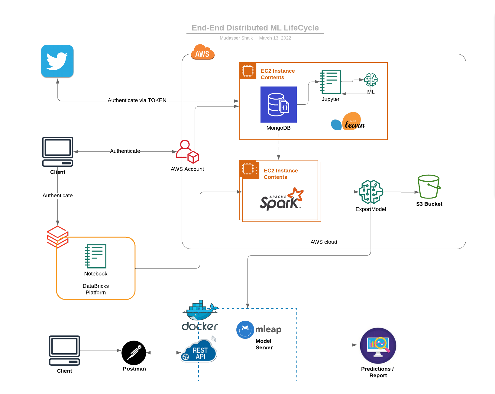

## Portfolio

- 👋 Hi, I’m @mudassershaik
- 👀 I’m interested in combining the powers of BigData, Information Quality and AI.
- 🌱 I’m currently learning probabilistic programing and GCP.
- ✨ I specialize in Apache Spark, Apache Beam, Hadoop and Kafka EcoSystem - Kafka-Connect-KStreams-kSQL.
- 💞️ I’m looking to collaborate on Streaming Systems, Data Initatives, ML-Ops.
- 📫 How to reach me - Slack `@Mudasser Shaik`

---

## Data Science

### End-End Distributed ML LifeCycle

As an instructor, I designed and taught the curriculum for End to End Distributed Machine Learning workflow at <a href="https://magnimindacademy.com/">Magnimind Academy</a>. From created a python - Data crawler application that extracts, cleans and store the Twitter data into MongoDB to train and deploy a NLP classification Model to Docker.

<ol>
  <li>Data ingestion and Preprocessing using Python - Twitter Extractor</li>
  <li>Feature Engineering using PySpark-ML</li>
  <li>Model Training and Evaluation</li> 
  <li>ML tracking using Apache MLflow </li>
  <li>Model Serialization using Apache Mleap</li>
  <li>Model Packaging and Deployment to Docker</li>
  <li>Schedule the training pipeline using Airflow</li>
</ol>

In this architecture diagram the Data ingestion and ML Training is deployed on Cloud AWS and Databricks. These services interact with each otheron cloud to make a common End to End Distributed ML workflow.

For deploying the ML model, we are using the Low latency Predictions Approach (non-Spark) using Apache Mleap and Docker.
Note: In our Session we use Community Databricks Edition which spins up One Spot-EC2 instance.

---
### Spark Crash Course

After my team preprocessed a dataset of 10K credit applications and built machine learning models to predict credit default risk, I built an interactive user interface with Streamlit and hosted the web app on Heroku server.

 

 

---

[Project 2 Title](/pdf/sample_presentation.pdf)

---
[Project 3 Title](http://example.com/)

---

### Category Name 2

- [Project 1 Title](http://example.com/)
- [Project 2 Title](http://example.com/)
- [Project 3 Title](http://example.com/)
- [Project 4 Title](http://example.com/)
- [Project 5 Title](http://example.com/)

---

© 2020 Shaik Mudasser. Powered by Jekyll and the Minimal Theme.

